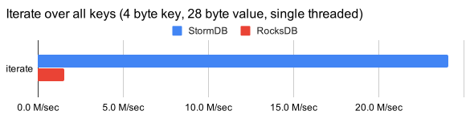

# StormDB
An embeddable, persistent key-value store optimised for sequential reads.

[](https://sonarcloud.io/dashboard?id=CleverTap_stormdb)
[](https://sonarcloud.io/dashboard?id=CleverTap_stormdb)
[](https://sonarcloud.io/dashboard?id=CleverTap_stormdb)

**Current Status:** Used in production by CleverTap.

## Goals
- High speed sequential read
- High speed random writes
- Affinity to cluster recently updated keys for higher random IO on such keys
- Ability to recover from file corruption

## Benchmarks
We ran a small benchmark for 100 million 4 byte keys with 28 byte values, and the results are shown below:

### Iteration


### Random


**Note:** We've only compared this with RocksDB since in all our previous benchmarks, 
we've observed that RocksDB was the fastest.

More details about this benchmark may be found [here](https://github.com/CleverTap/stormdb/wiki/Benchmarks).

## Motivation
The primary motivation behind StormDB was to achieve fast sequential scans across all keys
in the database. When we benchmarked sequential reads of popular key value stores, we realised:
1. None of them are as fast as simply reading the file from an SSD
    - We used `time cat 4GB_file >> /dev/null` to understand the raw throughput possible
    - None of the key value stores out there delivered anything close to this
1. Most are based on LSM, which requires all data to be sorted
    - This inherently doesn't provide an optimised technique to cluster recently
      updated keys together
1. Although a few keys are frequently updated and queried, LSM based stores would require
   all their data to be cached by the operating system file cache
    - On the contrary, StormDB clusters recently updated keys at the head of its data file
    - Therefore, the operating system can cache just the head of the data file,
      and provide high throughput random reads without caching the entire data file

## Getting Started
1. Add the CleverTap Maven Bintray repository
```xml
<repositories>
    <repository>
        <id>bintray-clevertap-Maven</id>
        <name>bintray</name>
        <url>https://dl.bintray.com/clevertap/Maven</url>
    </repository>
</repositories>
```
2. Add the Maven dependency
```xml
<!-- Heads up! Use the latest version from https://github.com/CleverTap/stormdb/releases/latest -->
<dependency>
    <groupId>com.clevertap</groupId>
    <artifactId>stormdb</artifactId>
    <version>1.0.0</version>
</dependency>
```
3. Create and use a StormDB instance
```java
// Create.
final StormDB db = new StormDBBuilder()
        .withDbDir("path/to/db")
        .withValueSize(28)
        .build();

// Put.
db.put(1, new byte[28]);

// Get.
final byte[] value = db.randomGet(1);

// Iterate over all keys.
db.iterate((key, data, dataOffset) -> {
    // Read 28 bytes starting at dataOffset in data[]. 
});

// Close.
db.close();
```

## Limitations
- Key sizes are restricted to 4 bytes (they're stored as integers internally)
- A database must be opened indicating the value size
    - As a result, once created, all values are always of the specified size
    - This is fixed, as StormDB is an offset based database

## FAQs    
### When should I consider using StormDB?
- Your keys are limited to 4 bytes (a maximum of ~4.2 billion keys per database)
- The size of your values are fixed
- You need to iterate over all keys very quickly (and not sorted in any order, other than recently updated keys)

If the answers to all the points above are a hard "yes", then you'd benefit from StormDB. 

## Contributing
We welcome anybody and everybody to contribute to the code, design, or report bugs.
If there's a feature which you'd like to see implemented, open an issue about it. If you'd
like to implement the feature yourself, please discuss the design before beginning 
its implementation.

A few pointers
- Style Guide: [_Google Style_](https://google.github.io/styleguide/javaguide.html) 
- SonarCloud quality gate

## Maintainers
StormDB is maintained by the CleverTap Labs team, with contributions
from the entire engineering team.

## License
StormDB is licensed under the MIT License. Please see LICENSE under the root directory.
 
